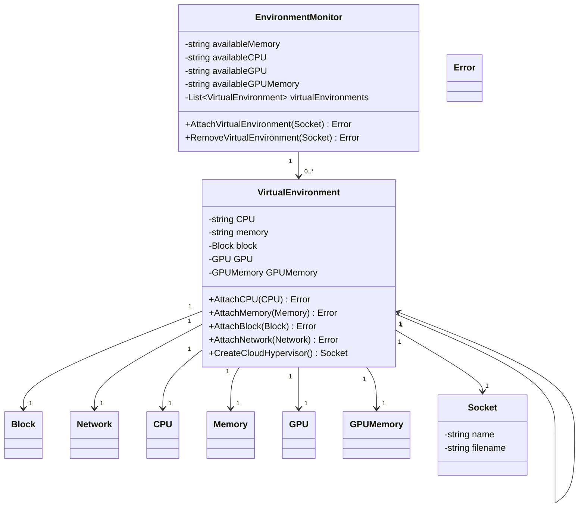

# Proposal for an Environment Monitor

## Problem Statement

- There is no reasonable way, that strongly encodes seperation of concerns, to currently manage collections of the
  various storage and network backends, as well as the vmm itself. The building blocks all exist, `ch-remote`,
  `cloud-hypervisor`, and various parts of DPDK/SPDK. Unfortunately they dont exist as one integrated unit.

## Solution

Ths proposal suggests the creation of a new process, that executes `cloud-hypervisor` and `ch-remote`, as well as the various
`SPDK`, `DPDK`, and other backends that are of interest. That process is encoded in the class diagram below called
`EnvironmentMonitor`. Additionally, it might be interesting if `EnvironmentMonitor` were less daemon and more stateless...

